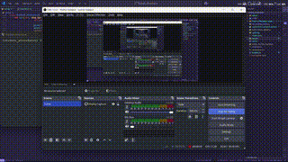

# Student Attendance Project

### Dataset Preparation : 
- Prepare **at least 50 images** for each student's faces in different perspective. Save in folders which are named by their *Student_ID* in `student_attendance/dataset/Student_ID`.
- Run `Augmentation_dataset.py` to make more dataset of student's faces if needed (recommendation if dataset is limited). The `facenet_dataset` folder will automatically generate, which is used to extract feature of their faces using *facenet*. The feature embedding is passed in the `SVM` to train to classify students.

### Dataset structure : 

```
/students_attendance/ 
   |----dataset/
           |------students/
                       |------facenet_dataset/
                                |--------train/
                                          |------MSSV1/
                                                   |--------.jpg, .png, .jpeg     
                                          |------MSSV2/
                                                   |--------.jpg, .png, .jpeg    
                                          ...
                                          |------MSSV30/
                                                   |--------.jpg, .png, .jpeg   
                                |--------test/
                                          |------MSSV1/
                                                   |--------.jpg, .png, .jpeg     
                                          |------MSSV2/
                                                   |--------.jpg, .png, .jpeg    
                                          ...
                                          |------MSSV30/
                                                   |--------.jpg, .png, .jpeg  
                                |--------val/
                                          |------MSSV1/
                                                   |--------.jpg, .png, .jpeg     
                                          |------MSSV2/
                                                   |--------.jpg, .png, .jpeg    
                                          ...
                                          |------MSSV30/
                                                   |--------.jpg, .png, .jpeg  
                       |------MSSV1/
                                |--------.jpg, .png, .jpeg
                       |------MSSV2/
                                |--------.jpg, .png, .jpeg
                       |------MSSV3/
                                |--------.jpg, .png, .jpeg
                            ......
                       |------MSSV30/
                                |--------.jpg, .png, .jpeg
```

> `train/` , `test/` and `val/` folders will be automatically generated when running `Augmentation_dataset.py` file.

### Demo


